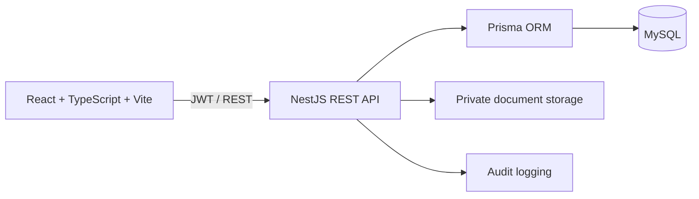

<div align="center">
	
	<h1>CLINICKA</h1>
	<p><strong>School Clinic Management System</strong></p>
	<p>A secure health information workspace for Brokenshire College in Davao City.</p>

  <p>
    <a href="docs/architecture.md">Architecture</a> ·
    <a href="docs/api.md">API Docs</a> ·
    <a href="docs/database.md">Database</a> ·
    <a href="docs/security.md">Security</a> ·
    <a href="docs/development.md">Development</a>
  </p>
</div>

## Overview

BCHealth is a web-based clinic information and records management system built for a private higher-education institution. It supports the day-to-day work of clinic nurses, physicians, dentists, administrators, students, and faculty or staff.

The system is designed as a **secure modular monolith**, not a hospital information system. It prioritizes privacy, clear workflows, role-based access, and a calm institutional interface.

## What It Covers

| Area | Purpose |
| --- | --- |
| Patient records | Student, faculty, and staff profiles, contacts, allergies, and conditions |
| Electronic health records | Clinic visits, vital signs, consultations, diagnoses, treatments, and prescriptions |
| Appointments | Scheduling and appointment status management |
| Requirements and clearances | Medical, dental, PE, sports, and employment-related records |
| Inventory | Medicines, batches, stock movements, expiry monitoring, and dispensing |
| Certificates and documents | Private patient documents and issued medical certificates |
| Security and audit | JWT authentication, RBAC, rate limiting, and audit events |

## Architecture



### Repository Structure

```text
apps/
├── api/          NestJS API, authentication, RBAC, and domain modules
└── web/          React frontend, routes, layouts, and clinic workflows
packages/
├── config/       Shared roles and permission constants
└── types/        Shared API-facing TypeScript types
prisma/           MySQL schema, migrations, and seed data
docs/             Architecture, API, database, security, and development notes
```

## Technology

- **Frontend:** React, TypeScript, Vite, Tailwind CSS, React Router
- **Data and forms:** TanStack Query, React Hook Form, Zod, Axios
- **Backend:** NestJS, TypeScript, REST, Swagger
- **Persistence:** MySQL, Prisma
- **Security:** JWT, refresh-token rotation, RBAC, Helmet, CORS, rate limiting
- **Testing:** Vitest, Testing Library, Jest, and Supertest
- **Database:** MySQL 8.4+ running locally or on a managed database service

## Getting Started

### Requirements

- Node.js 24+
- npm 11+
- MySQL 8.4+

### Installation

```bash
npm install
copy .env.example .env
npm run prisma:generate
npm run prisma:migrate
npm run prisma:seed
```

On macOS or Linux, replace the `copy` command with:

```bash
cp .env.example .env
```

Update `.env` with local secrets before using the application outside development.

### Run Locally

Start the API and web app in separate terminals:

```bash
npm run dev --workspace @bchealth/api
npm run dev --workspace @bchealth/web
```

| Service | URL |
| --- | --- |
| Web application | [http://localhost:5173](http://localhost:5173) |
| REST API | [http://localhost:3000/api](http://localhost:3000/api) |
| Swagger | [http://localhost:3000/api/docs](http://localhost:3000/api/docs) |

## Demo Access

Seed data includes development-only accounts. Do not use these credentials in a production environment.

```text
Email:    admin.demo@brokenshire.edu.ph
Password: DemoPass123!
```

Additional seeded accounts use the `*.demo@brokenshire.edu.ph` email pattern.

## Security and Privacy

BCHealth handles sensitive health information. The application foundation includes:

- Hashed passwords and JWT access tokens
- Hashed, rotated refresh tokens
- Server-side role-based access control
- Request validation with whitelisting
- Helmet security headers and environment-controlled CORS
- Authentication rate limiting
- Audit events for login and logout
- Private document storage requirements

Security controls are not a substitute for institutional policy. Production deployment should also include ownership checks, document authorization, sanitized error handling, structured logging with redaction, retention rules, backups, and privacy review under the Philippine Data Privacy Act of 2012.

Read the complete security notes in [docs/security.md](docs/security.md).

## Development Commands

```bash
npm run build
npm run lint
npm test
```

Workspace-specific commands are available through npm workspaces:

```bash
npm run build --workspace @bchealth/api
npm run build --workspace @bchealth/web
npm run test --workspace @bchealth/web
```

## Project Status

The foundation, authentication, RBAC, dashboard shell, and patient profile workflows are in place. The API currently exposes the health, authentication, users, and patients areas; additional clinic modules are being connected incrementally.

The implementation approach for each new module is:

1. Define the domain contract and authorization rules.
2. Add validated DTOs, services, and controllers.
3. Connect the React workflow to the real API.
4. Add loading, empty, error, audit, and test coverage.
5. Document the behavior and deployment considerations.

## Documentation

- [Architecture](docs/architecture.md)
- [API](docs/api.md)
- [Database](docs/database.md)
- [Security](docs/security.md)
- [Development](docs/development.md)

## License

This project is maintained for Brokenshire College clinic operations and development purposes.
