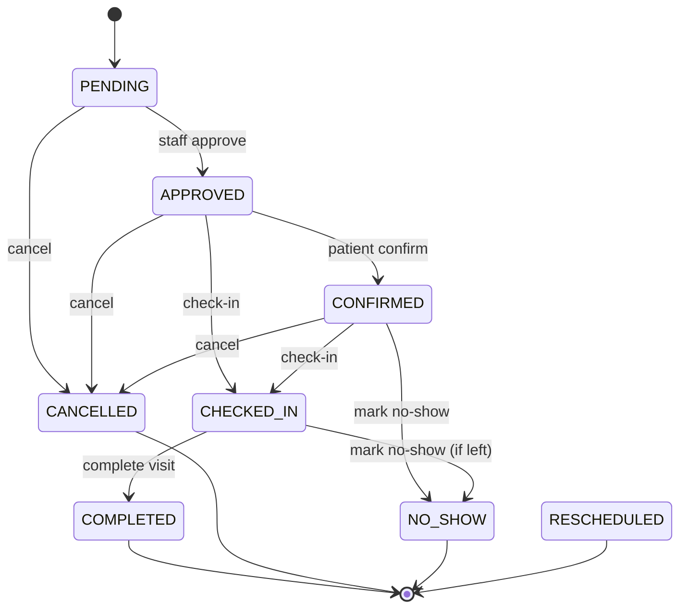

# Scheduling Engine Technical Specification

## Overview

This document specifies the design and implementation of a scheduling engine for the BCHealth system that enforces strict business rules around capacity management, appointment state transitions, and visit linkage.

---

## 1. Current State Analysis

### Existing Appointment Model
```prisma
model Appointment {
  id                 String              @id @default(uuid())
  patientId          String
  patient            Patient             @relation(fields: [patientId], references: [id])
  assignedToId       String?
  assignedTo         User?               @relation(fields: [assignedToId], references: [id])
  scheduledAt        DateTime
  durationMins       Int                 @default(30)
  purpose            String
  type               AppointmentType     @default(CONSULTATION)
  priority           AppointmentPriority @default(ROUTINE)
  status             AppointmentStatus   @default(PENDING)
  notes              String?
  cancellationReason String?
  createdAt          DateTime            @default(now())
  updatedAt          DateTime            @updatedAt

  @@index([scheduledAt])
  @@index([patientId, scheduledAt])
}
```

### Current AppointmentStatus Enum
```prisma
enum AppointmentStatus {
  PENDING
  APPROVED
  CONFIRMED
  COMPLETED
  CANCELLED
  NO_SHOW
  RESCHEDULED
}
```

### Identified Gaps
1. **No overlap detection**: Current `create()` only checks exact `scheduledAt` match, ignores `durationMins`
2. **No capacity limits**: No concept of provider/slot capacity
3. **No state machine**: `updateStatus()` allows any status → any status transition
4. **Check-in bug**: Sets status to `COMPLETED` instead of a `CHECKED_IN` state; no visit linkage enforcement
5. **Missing CHECKED_IN status**: Enum lacks a `CHECKED_IN` state distinct from `COMPLETED`

---

## 2. Capacity Management Specification

### 2.1 Slot-Based Capacity Model

The system uses **time-slot capacity** rather than simple time-point conflict detection.

#### Core Concepts
- **Time Slot**: A discrete interval `[start, end)` where `end = start + durationMins`
- **Capacity Unit**: A provider (or resource) + time slot combination
- **Max Concurrent Appointments**: Configurable per provider/resource (default: 1)

#### Overlap Detection Algorithm
Two appointments **overlap** iff:
```
A.scheduledAt < B.scheduledAt + B.durationMins
AND
B.scheduledAt < A.scheduledAt + A.durationMins
```

#### Capacity Check on Create/Reschedule
```typescript
async function checkCapacity(
  providerId: string,
  scheduledAt: DateTime,
  durationMins: number,
  excludeAppointmentId?: string
): Promise<boolean> {
  const overlapping = await prisma.appointment.count({
    where: {
      assignedToId: providerId,
      status: { in: ACTIVE_STATUSES }, // PENDING, APPROVED, CONFIRMED, CHECKED_IN
      scheduledAt: {
        lt: scheduledAt + durationMins,
      },
      // Also need end time comparison
      // Prisma doesn't support computed fields in where, so we fetch and filter
    },
  });

  return overlapping < getProviderCapacity(providerId);
}
```

#### Provider Capacity Configuration
```prisma
model ProviderSchedule {
  id            String   @id @default(uuid())
  providerId    String
  provider      User     @relation(fields: [providerId], references: [id])
  dayOfWeek     Int      // 0-6 (Sunday-Saturday)
  startTime     String   // HH:mm format
  endTime       String   // HH:mm format
  maxConcurrent Int      @default(1)
  isActive      Boolean  @default(true)

  @@unique([providerId, dayOfWeek])
}
```

**Alternative (simpler)**: Add `maxConcurrentAppointments` to `User` model or use a system setting. For MVP, use a global setting `APPOINTMENT_MAX_CONCURRENT_PER_PROVIDER = 1`.

### 2.2 Appointment Type Capacity Policies

| Type | Default Duration | Max Concurrent | Overlap Policy |
|------|------------------|----------------|----------------|
| CONSULTATION | 30 min | 1 | Strict (no overlap) |
| FOLLOW_UP | 15 min | 1 | Strict |
| VACCINATION | 10 min | 2 | Allow 2 concurrent |
| SCREENING | 20 min | 1 | Strict |
| CLEARANCE | 30 min | 1 | Strict |
| OTHER | 30 min | 1 | Strict |

---

## 3. State Machine Specification

### 3.1 Revised AppointmentStatus Enum

**New enum (requires migration):**
```prisma
enum AppointmentStatus {
  PENDING        // Created, awaiting approval
  APPROVED       // Approved by staff
  CONFIRMED      // Patient confirmed attendance
  CHECKED_IN     // Patient physically present (NEW)
  COMPLETED      // Visit finished, documentation done
  CANCELLED      // Cancelled by patient or staff
  NO_SHOW        // Patient did not arrive
  RESCHEDULED    // Moved to new time (terminal for old appointment)
}
```

### 3.2 State Transition Diagram



### 3.3 Transition Table (Source → Permitted Targets)

| Current Status | Permitted Next Statuses |
|----------------|-------------------------|
| PENDING | APPROVED, CANCELLED |
| APPROVED | CONFIRMED, CHECKED_IN, CANCELLED |
| CONFIRMED | CHECKED_IN, CANCELLED, NO_SHOW |
| CHECKED_IN | COMPLETED, NO_SHOW |
| COMPLETED | *(terminal)* |
| CANCELLED | *(terminal)* |
| NO_SHOW | *(terminal)* |
| RESCHEDULED | *(terminal)* |

### 3.4 Invalid Transitions (Rejected with 422)

| Attempted | Reason |
|-----------|--------|
| PENDING → COMPLETED | Must pass through APPROVED/CONFIRMED → CHECKED_IN |
| PENDING → NO_SHOW | Must be confirmed/checked-in first |
| APPROVED → COMPLETED | Must check in first |
| CONFIRMED → COMPLETED | Must check in first |
| CHECKED_IN → CANCELLED | Cannot cancel after check-in; use NO_SHOW |
| COMPLETED → *any* | Terminal state |
| CANCELLED → *any* | Terminal state |
| NO_SHOW → *any* | Terminal state |
| RESCHEDULED → *any* | Terminal state |
| *any* → RESCHEDULED | Use reschedule operation (creates new appointment) |

### 3.5 Reschedule Operation

Rescheduling is **not a status transition** but a **compound operation**:
1. Create new appointment with new `scheduledAt` (status: PENDING or APPROVED)
2. Mark original appointment as `RESCHEDULED` (terminal)
3. Link via `originalAppointmentId` / `rescheduledFromId` (add field)

```prisma
model Appointment {
  // ... existing fields
  rescheduledFromId   String?   @unique
  rescheduledFrom     Appointment? @relation("RescheduleChain", fields: [rescheduledFromId], references: [id])
  rescheduledTo       Appointment? @relation("RescheduleChain", fields: [rescheduledToId], references: [id])
  rescheduledToId     String?   @unique
}
```

---

## 4. Visit Linkage Specification

### 4.1 Check-In Transition Rules

**Trigger**: `POST /appointments/:id/check-in` from status `APPROVED` or `CONFIRMED`

**Atomic Transaction**:
1. Verify appointment status ∈ {APPROVED, CONFIRMED}
2. Verify no existing `ClinicVisit` linked to this appointment
3. Create `ClinicVisit` with:
   - `patientId` = appointment.patientId
   - `chiefComplaint` = appointment.purpose
   - `notes` = appointment.notes
   - `appointmentId` = appointment.id (NEW field)
4. Update appointment status → `CHECKED_IN`
5. Create audit log for both

### 4.2 Visit-Appointment Linkage

Add foreign key to `ClinicVisit`:
```prisma
model ClinicVisit {
  // ... existing fields
  appointmentId    String?
  appointment      Appointment? @relation(fields: [appointmentId], references: [id])

  @@index([appointmentId])
}
```

**Constraints**:
- `appointmentId` is optional (walk-in visits have no appointment)
- `appointmentId` is unique (1:1) — enforced by `@unique` on `Appointment.rescheduledFromId` equivalent, or by application logic
- Check-in rejected if `ClinicVisit` already exists for this appointment

### 4.3 Visit Completion Independence

Once checked-in, the `ClinicVisit` lifecycle is **independent** of the appointment:
- Visit follows its own state machine (OPEN → IN_CONSULTATION → COMPLETED)
- Appointment moves to `COMPLETED` only when visit is completed
- Or appointment stays `CHECKED_IN` until visit completion triggers appointment completion

**Recommended flow**:
```
Appointment: CONFIRMED → CHECKED_IN → COMPLETED (when visit completes)
Visit:        OPEN → IN_CONSULTATION → COMPLETED
```

---

## 5. Implementation Plan

### Phase 1: Database Migration
1. Add `CHECKED_IN` to `AppointmentStatus` enum
2. Add `appointmentId` to `ClinicVisit` model (optional, unique)
3. Add `rescheduledFromId` / `rescheduledToId` to `Appointment` for reschedule chain
4. Add `maxConcurrentAppointments` to `User` or create `ProviderSchedule` model
5. Run `prisma migrate dev`

### Phase 2: State Machine Module
Create `src/appointments/state-machine/`:
- `appointment-transitions.ts` — canonical transition table
- `appointment-state-machine.exceptions.ts` — descriptive exceptions
- `appointment-state-machine.ts` — `AppointmentStateMachine` service

### Phase 3: Capacity Service
Create `src/appointments/capacity/`:
- `capacity-checker.ts` — overlap detection, capacity validation
- `provider-capacity.ts` — provider-specific limits

### Phase 4: Service Refactor
Update `AppointmentsService`:
- Inject `AppointmentStateMachine`, `CapacityChecker`, `AuditService`
- `create()` → validate capacity before create
- `updateStatus()` → validate via state machine, record audit with old/new status
- `checkIn()` → atomic visit creation + status transition to `CHECKED_IN`
- `reschedule()` → compound operation (new appointment + mark old RESCHEDULED)

### Phase 5: Controller Updates
- `POST /appointments/:id/reschedule` — new endpoint
- `PATCH /appointments/:id/status` — now validates transitions
- `POST /appointments/:id/check-in` — creates visit, sets `CHECKED_IN`

### Phase 6: Tests
- State machine unit tests (valid/invalid transitions)
- Capacity checker tests (overlap, concurrent limits)
- Integration tests for check-in → visit creation (1:1)
- Reschedule chain tests

---

## 6. API Contracts

### Create Appointment
```http
POST /api/appointments
{
  "patientId": "uuid",
  "scheduledAt": "2026-09-20T10:00:00Z",
  "durationMins": 30,
  "purpose": "Consultation",
  "type": "CONSULTATION",
  "priority": "ROUTINE",
  "assignedToId": "provider-uuid"  // optional
}
```
**Response**: 201 Created + appointment
**Errors**: 409 Conflict (capacity exceeded), 404 (patient not found)

### Update Status
```http
PATCH /api/appointments/:id/status
{ "status": "APPROVED" }
```
**Response**: 200 OK + updated appointment
**Errors**: 422 Invalid transition, 404 Not found

### Check-In
```http
POST /api/appointments/:id/check-in
```
**Response**: 200 OK + { appointment, visit }
**Errors**: 422 Invalid status for check-in, 409 Visit already exists

### Reschedule
```http
POST /api/appointments/:id/reschedule
{
  "scheduledAt": "2026-09-21T14:00:00Z",
  "durationMins": 30,
  "reason": "Patient requested"
}
```
**Response**: 201 Created + { newAppointment, oldAppointment }
**Errors**: 409 Capacity conflict, 422 Invalid original status

---

## 7. Acceptance Criteria Verification

| Requirement | Implementation |
|-------------|----------------|
| Reject overlapping appointments | `CapacityChecker.validate()` in `create()` and `reschedule()` |
| Validate all status transitions | `AppointmentStateMachine.validateTransition()` in `updateStatus()` |
| Reject invalid jumps (e.g., Cancelled → Checked-in) | Transition table enforces terminal states |
| Check-in creates exactly one visit | Atomic transaction + unique `appointmentId` on `ClinicVisit` |
| 1:1 appointment:visit on check-in | Unique constraint + existence check |

---

## 8. Error Message Examples

**Overlap rejection:**
```json
{
  "success": false,
  "statusCode": 409,
  "message": "Appointment overlaps with existing booking for provider Dr. Smith at 2026-09-20T10:00:00Z. Available capacity: 0/1."
}
```

**Invalid transition:**
```json
{
  "success": false,
  "statusCode": 422,
  "message": "Invalid appointment status transition: cannot move from 'CANCELLED' to 'CHECKED_IN'. Permitted transitions from 'CANCELLED': none (terminal state)."
}
```

**Check-in duplicate:**
```json
{
  "success": false,
  "statusCode": 409,
  "message": "Appointment has already been checked in. Visit 'visit-uuid' was created at 2026-09-19T10:00:00Z."
}
```

---

## 9. Migration Notes

### Prisma Migration Steps
```bash
# 1. Edit schema.prisma with new enum value and fields
# 2. Generate migration
npx prisma migrate dev --name add-checkin-state-and-visit-linkage

# 3. Backfill existing COMPLETED appointments that were actually check-ins
# (if needed, based on data analysis)
```

### Enum Migration Safety
Adding `CHECKED_IN` to enum is safe (append-only). Existing `COMPLETED` records remain valid.

---

## 10. Future Extensions

1. **Waitlist**: Auto-promote when slot frees
2. **Recurring appointments**: Template-based scheduling
3. **Multi-resource booking**: Room + provider + equipment
4. **Patient self-scheduling**: Portal integration with real-time availability
5. **Analytics**: Utilization rates, no-show prediction

---

*Document Version: 1.0*  
*Author: BCHealth Engineering*  
*Date: 2026-09-19*