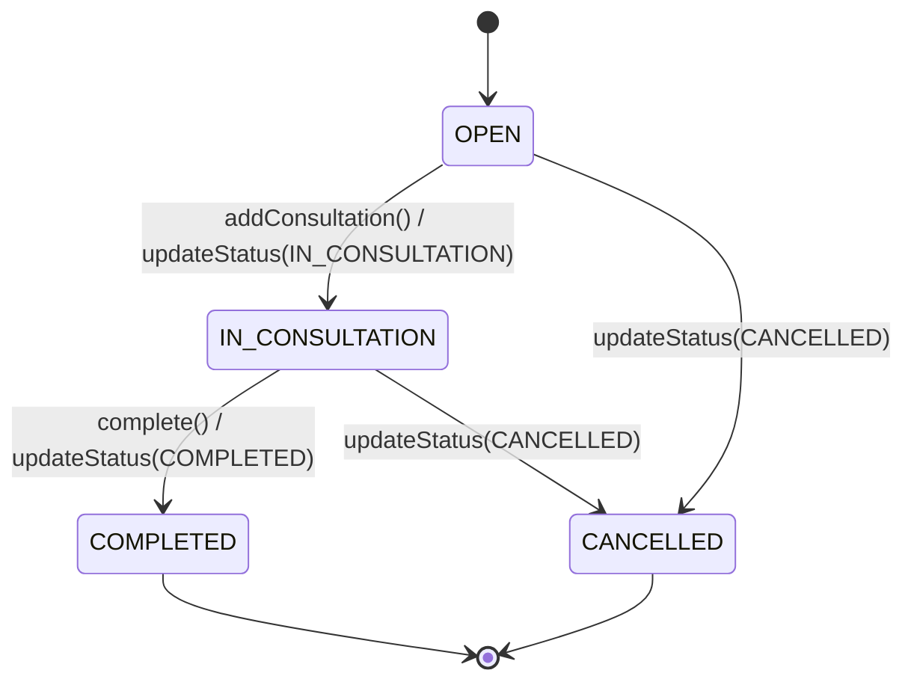

# Visit Status State Machine

This document formally defines the state machine governing clinic visit status transitions in the BCHealth system.

## States

| State | Description | Terminal |
|-------|-------------|:--------:|
| `OPEN` | Visit created; patient waiting or being triaged | No |
| `IN_CONSULTATION` | Clinician actively recording consultation | No |
| `COMPLETED` | Visit finished; all clinical documentation complete | **Yes** |
| `CANCELLED` | Visit cancelled; no further action required | **Yes** |

## Transition Table

```
┌────────────────────┬────────────────────────────────────────────────────┐
│ Current State      │ Permitted Next States                              │
├────────────────────┼────────────────────────────────────────────────────┤
│ OPEN               │ IN_CONSULTATION, CANCELLED                         │
│ IN_CONSULTATION    │ COMPLETED, CANCELLED                               │
│ COMPLETED          │ (none — terminal)                                  │
│ CANCELLED          │ (none — terminal)                                  │
└────────────────────┴────────────────────────────────────────────────────┘
```

## State Diagram



## Valid Transitions

| From → To | Trigger | Prerequisites |
|-----------|---------|---------------|
| `OPEN` → `IN_CONSULTATION` | `POST /clinic-visits/:id/consultation` or `PATCH /clinic-visits/:id/status` | None |
| `OPEN` → `CANCELLED` | `PATCH /clinic-visits/:id/status` | None |
| `IN_CONSULTATION` → `COMPLETED` | `POST /clinic-visits/:id/complete` or `PATCH /clinic-visits/:id/status` | **Vital signs recorded** AND **consultation note documented** |
| `IN_CONSULTATION` → `CANCELLED` | `PATCH /clinic-visits/:id/status` | None |

## Invalid Transitions (Rejected with 422)

| Attempted Transition | Reason |
|---------------------|--------|
| `OPEN` → `COMPLETED` | Must pass through `IN_CONSULTATION`; clinical prerequisites not enforceable |
| `IN_CONSULTATION` → `OPEN` | Backward transition not permitted |
| `COMPLETED` → *any* | Terminal state — cannot be modified |
| `CANCELLED` → *any* | Terminal state — cannot be modified |
| `OPEN` → `OPEN` | No-op — idempotent but rejected to signal redundancy |
| `IN_CONSULTATION` → `IN_CONSULTATION` | No-op — idempotent but rejected to signal redundancy |

## Completion Prerequisites

A visit may only transition to `COMPLETED` when **all** of the following are true:

1. **Current status is `IN_CONSULTATION`** — completing from `OPEN` is rejected.
2. **At least one VitalSigns record exists** — e.g., temperature, blood pressure, pulse, etc.
3. **At least one Consultation record exists** — clinician assessment, plan, diagnoses, treatments.

If any prerequisite is missing, the transition is rejected with a descriptive error:
> `Cannot complete visit: the longitudinal record is incomplete. Missing required clinical actions: vital signs and consultation note.`

## Audit Trail

Every state transition produces an immutable `AuditLog` entry containing:

| Field | Value | Source |
|-------|-------|--------|
| `actorId` | ID of the user who initiated the transition | JWT `sub` claim |
| `action` | Specific `AuditAction` enum value (e.g., `VISIT_STATUS_COMPLETED`) | Target state mapping |
| `entity` | `'ClinicVisit'` | Constant |
| `entityId` | Visit UUID | Route parameter |
| `oldValue` | `{ "status": "<from>" }` | Source state |
| `newValue` | `{ "status": "<to>" }` | Target state |
| `metadata` | `{ "fromStatus": "<from>", "toStatus": "<to>", "transition": "<from> -> <to>" }` | Structured summary |
| `createdAt` | ISO 8601 timestamp | Database default (`now()`) |

Example audit entry for `OPEN → IN_CONSULTATION`:

```json
{
  "actorId": "user-42",
  "action": "VISIT_STATUS_IN_CONSULTATION",
  "entity": "ClinicVisit",
  "entityId": "a1b2c3d4-e5f6-7890-abcd-ef1234567890",
  "oldValue": { "status": "OPEN" },
  "newValue": { "status": "IN_CONSULTATION" },
  "metadata": {
    "fromStatus": "OPEN",
    "toStatus": "IN_CONSULTATION",
    "transition": "OPEN -> IN_CONSULTATION"
  },
  "createdAt": "2026-09-19T10:15:30.123Z"
}
```

## Error Responses

All invalid transitions return **HTTP 422 Unprocessable Entity** with a descriptive message:

```json
{
  "success": false,
  "statusCode": 422,
  "message": "Invalid visit status transition: cannot move visit from 'OPEN' to 'COMPLETED'. Permitted transitions from 'OPEN' are: 'IN_CONSULTATION', 'CANCELLED'.",
  "timestamp": "2026-09-19T10:15:30.123Z",
  "path": "/api/clinic-visits/visit-123/status"
}
```

Completion prerequisite failures return:

```json
{
  "success": false,
  "statusCode": 422,
  "message": "Cannot complete visit: the longitudinal record is incomplete. Missing required clinical actions: vital signs and consultation note. Vital signs and a consultation note must be documented before a visit can be marked COMPLETED.",
  "timestamp": "2026-09-19T10:15:30.123Z",
  "path": "/api/clinic-visits/visit-123/complete"
}
```

## API Endpoints

| Method | Endpoint | Description |
|--------|----------|-------------|
| `PATCH` | `/clinic-visits/:id/status` | Transition to any permitted status |
| `POST` | `/clinic-visits/:id/complete` | Convenience: transition to `COMPLETED` (validates prerequisites) |
| `POST` | `/clinic-visits/:id/consultation` | Record consultation; auto-advances `OPEN → IN_CONSULTATION` |

## Implementation Notes

- **Single source of truth**: `src/visits/state-machine/visit-transitions.ts` defines the canonical transition table.
- **Validation**: `VisitStateMachine` service enforces transitions, completion prerequisites, and audit recording atomically.
- **Idempotency**: Self-transitions (e.g., `COMPLETED → COMPLETED`) are explicitly rejected to surface redundant requests.
- **Terminal states**: Once `COMPLETED` or `CANCELLED`, a visit cannot be modified. Attempting to add a consultation to a terminal visit is rejected.
- **Transactional safety**: All transitions can run inside a Prisma transaction by passing a `client` option.